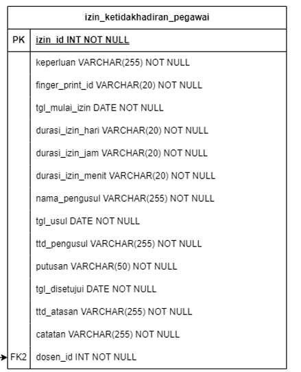
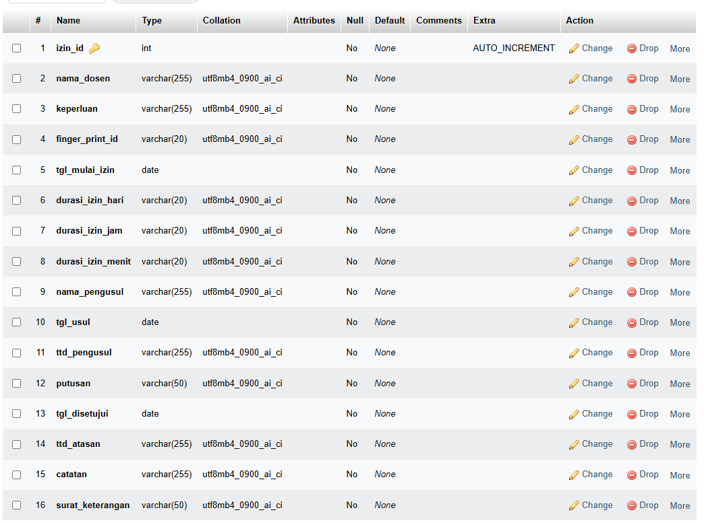
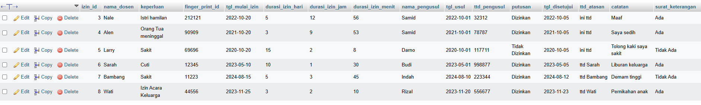
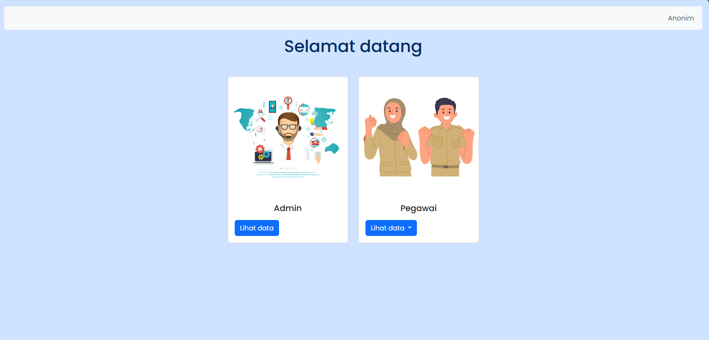
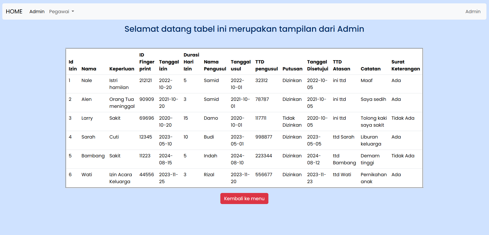
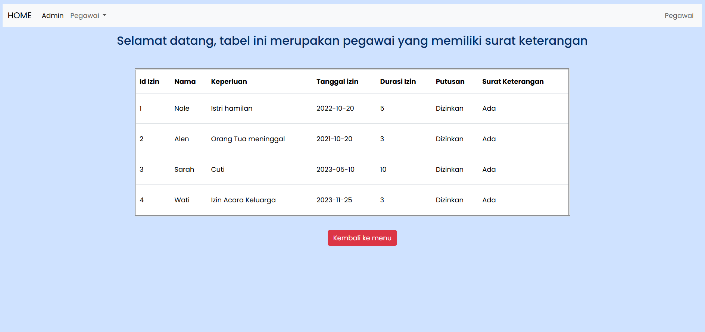
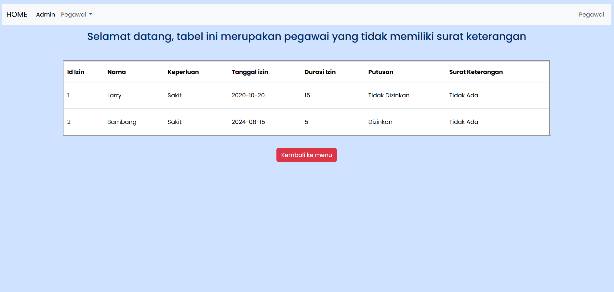

# PWEB 2 - TUGAS 2

<pre>
Nama  : Nalindra Driyawan Thahai
Kelas : TI-2C
NPM   : 230202070
</pre>

## Soal:

1. Create an OOP-based View, by retrieving data from the MySQL database
2. Use the _construct as a link to the database
3. Apply encapsulation according to the logic of the case study
4. Create a derived class using the concept of inheritance
5. Apply polymorphism for at least 2 roles according to the case study

<div align='justify'>

## TABLE:


## DATABASE:


## ISI TABLE:


<hr>

### 1. Membuat class untuk menyambungkan ke database

```php
<?php

class Database {
    private $host = "localhost";
    private $username = "root";
    private $password = "";
    private $database = "izin_ketidakhadiran_pegawai";
    protected $koneksi;

 
    public function __construct() {

        $this->koneksi = mysqli_connect($this->host, $this->username, $this->password, $this->database);

        if (!$this->koneksi) {
            die("Koneksi database gagal: " . mysqli_connect_error());
        } else {

        }
    }
    public function Aksi()
    {
        return("");
    }
}

$database = new Database();
?>
```
### + POINT PENTING

- Di potongan coding ini saya membuat class Database yang berisi property `$host`,`$username`,`$password`,`$database`. Keempat property ini bersifat private karena mereka hanya akan digunakan di class database, ini merupakan Encapsulation.
```php
class Database {
    private $host = "localhost";
    private $username = "root";
    private $password = "";
    private $database = "izin_ketidakhadiran_pegawai";

```
- Terdapat juga property `$koneksi` yang bersifat protected karena properti ini akan digunakan oleh class class anakan dari class database.
```php
 protected $koneksi;
 ```
 - Di dalam class database terdapat method `__construct()` yang digunakan untuk menghubungkan codingan dengan database. Disini terdapat logika if yang digunakan jika terjadi kesalahan dalam menyambungkan koneksi. Ini merukan bentuk inialisasi
```php
public function __construct() {

        $this->koneksi = mysqli_connect($this->host, $this->username, $this->password, $this->database);

        if (!$this->koneksi) {
            die("Koneksi database gagal: " . mysqli_connect_error());
        } else {

        }
    }
```
- Di dalam class database terdapat method `Aksi()` yang digunakan sebagai bentuk polymorphism dan overriding.

```php
    public function Aksi()
    {
        return("");
    }
```
- Jangan lupa untuk instansiasi class tersebut agar koneksi berjalan.
```php
$database = new Database();
```

### 2. Membuat tampilan front end untuk membuat navbar
```html
<!doctype html>
<html lang="en">
<head>
    <meta charset="utf-8">
    <link
        href="https://cdn.jsdelivr.net/npm/remixicon@4.3.0/fonts/remixicon.css"
        rel="stylesheet" />
    <link rel="preconnect" href="https://fonts.googleapis.com">
    <link rel="preconnect" href="https://fonts.gstatic.com" crossorigin>
    <link href="https://fonts.googleapis.com/css2?family=Poppins:ital,wght@0,100;0,200;0,300;0,400;0,500;0,600;0,700;0,800;0,900;1,100;1,200;1,300;1,400;1,500;1,600;1,700;1,800;1,900&display=swap" rel="stylesheet">
    <meta name="viewport" content="width=device-width, initial-scale=1">
    <title>SI Ketidakhadiran</title>
    <link href="https://cdn.jsdelivr.net/npm/bootstrap@5.3.3/dist/css/bootstrap.min.css" rel="stylesheet" integrity="sha384-QWTKZyjpPEjISv5WaRU9OFeRpok6YctnYmDr5pNlyT2bRjXh0JMhjY6hW+ALEwIH" crossorigin="anonymous">
</head>

<body style="font-family: 'poppins';" class="p-3 mb-2 bg-primary-subtle text-primary-emphasis">

    <script src="https://cdn.jsdelivr.net/npm/bootstrap@5.3.3/dist/js/bootstrap.bundle.min.js" integrity="sha384-YvpcrYf0tY3lHB60NNkmXc5s9fDVZLESaAA55NDzOxhy9GkcIdslK1eN7N6jIeHz" crossorigin="anonymous"></script>

    <nav class="navbar navbar-expand-lg bg-body-tertiary rounded-2">
        <div class="container-fluid">

            <button class="navbar-toggler" type="button" data-bs-toggle="collapse" data-bs-target="#navbarNav" aria-controls="navbarNav" aria-expanded="false" aria-label="Toggle navigation">
                <span class="navbar-toggler-icon"></span>
            </button>
            <div class="collapse navbar-collapse" id="navbarNav">
                <ul class="navbar-nav">
                    <li class="nav-item">
                        <a class="nav-link active" aria-current="page" href="#"></a>
                    </li>
                </ul>
                <ul class="navbar-nav ms-auto">
                    <li class="nav-item">
                        <a class="nav-link" href="#">Anonim</a>
                    </li>
                </ul>
            </div>
        </div>
    </nav>
    <H1 class="d-flex justify-content-center align-items-center mt-3">Selamat datang </H1>
    <div class="d-flex justify-content-center align-items-center mt-5">
        <div class="d-flex justify-content-center gap-4">
            <div class="card" style="width: 18rem">
                
                <div class="card-body">
                    <h5 class="card-title text-center">Admin</h5>
                    <a href="./admin.php" class="btn btn-primary mt-2">Lihat data</a>
                </div>
            </div>
            <div class="card" style="width: 18rem">
                
                <div class="card-body">
                    <h5 class="card-title text-center">Pegawai</h5>
                    <p class="card-text"></p>
                    <div style="position: relative;">
                    <div class="dropdown">
                    <button class="btn btn-primary dropdown-toggle" type="button" data-bs-toggle="dropdown" aria-expanded="false">
                    Lihat data
                    </button>
                    <ul class="dropdown-menu">
                        <li><a class="dropdown-item" href="./ada.php">Ada surat</a></li>
                        <li><a class="dropdown-item" href="./tdk_ada.php"> Tidak ada surat</a></li>
                            </ul>
                        </div>
                    </div>
                </div>
            </div>
        </div>
    </div>
</body>

</html>
```
### 3. Membuat class untuk role Admin
```php
<?php
require_once ('koneksi.php');

class Admin extends Database{

    public function __construct(){
        parent::__construct();
}

public function Aksi(){
    $masuk = "SELECT * from ketidakhadiran ";
    return $this->koneksi->query($masuk);
    }

}

$nale = new Admin();

$nale1 = $nale->Aksi();
?>
<!doctype html>
<html lang="en">
  <head>
    <meta charset="utf-8">
    <link rel="preconnect" href="https://fonts.googleapis.com">
    <link rel="preconnect" href="https://fonts.gstatic.com" crossorigin>
    <link href="https://fonts.googleapis.com/css2?family=Poppins:ital,wght@0,100;0,200;0,300;0,400;0,500;0,600;0,700;0,800;0,900;1,100;1,200;1,300;1,400;1,500;1,600;1,700;1,800;1,900&display=swap" rel="stylesheet">
    <meta name="viewport" content="width=device-width, initial-scale=1">
    <title>SI Ketidakhadiran</title>
    <link href="https://cdn.jsdelivr.net/npm/bootstrap@5.3.3/dist/css/bootstrap.min.css" rel="stylesheet" integrity="sha384-QWTKZyjpPEjISv5WaRU9OFeRpok6YctnYmDr5pNlyT2bRjXh0JMhj

    ....

    <div class="container mt-3">
    <H3 class="d-flex justify-content-center align-items-center mt-3 mb-5">Selamat datang tabel ini merupakan tampilan dari Admin </H3>
      <table class="table" border="4">
        <thead>
          <tr>
            <th scope="col">Id Izin</th>
            <th scope="col">Nama</th>
            <th scope="col">Keperluan</th>
            <th scope="col">ID Finger print</th>
            <th scope="col">Tanggal izin</th>
            <th scope="col">Durasi Hari Izin</th>
            <th scope="col">Nama Pengusul</th>
            <th scope="col">Tanggal usul</th>
            <th scope="col">TTD pengusul</th>
            <th scope="col">Putusan</th>
            <th scope="col">Tanggal Disetujui</th>
            <th scope="col">TTD Atasan</th>
            <th scope="col">Catatan</th>
            <th scope="col">Surat Keterangan</th>
          </tr>
        </thead>
        <tbody>
          <tr>
            <?php 
              $no = 1;
              foreach ($nale1 as $row) {
            ?>
            <tr>
              <td><?php echo $no++; ?></td>
              <td><?php echo $row['nama_dosen']; ?></td>
              <td><?php echo $row['keperluan']; ?></td>
              <td><?php echo $row['finger_print_id']; ?></td>
              <td><?php echo $row['tgl_mulai_izin']; ?></td>
              <td><?php echo $row['durasi_izin_hari']; ?></td>
              <td><?php echo $row['nama_pengusul']; ?></td>
              <td><?php echo $row['tgl_usul']; ?></td>
              <td><?php echo $row['ttd_pengusul']; ?></td>
              <td><?php echo $row['putusan']; ?></td>
              <td><?php echo $row['tgl_disetujui']; ?></td>
              <td><?php echo $row['ttd_atasan']; ?></td>
              <td><?php echo $row['catatan']; ?></td>
              <td><?php echo $row['surat_keterangan']; ?></td>
            </tr>
            <?php
              }
            ?>
          </tr>
        </tbody>
      </table>
      <div class="btn-container mt-3 floatleft">
        <a href="./index.php" class="btn btn-danger">Kembali ke menu</a>
      </div>
    </div>
  </body>
</html>
```
### + POINT PENTING!!!

- Gunakan syntax `require_once` kepada koneksi.php agar isi dari koneksi.php dapat digunakan (menyambungkan ke database).

```php
require_once ('koneksi.php');
```
- Synthax entends disini merujuk kepada class 'Admin' yang merupakan anakan dari class database. Dsini juga ada syntax `parent::__construct()` yang digunakan untuk mengambil properti yang dapat diturunkan dari class utama, dalam kasus ini saya mengambil properti `$koneksi` dari class Database
```php
class Admin extends Database{

    public function __construct(){
        parent::__construct();
}
```
- Method ini merupakan hasil overriding dari method `Aksi()` di class database. Method ini akan mengembalikan semua data yang terdapat di tabel ketidakhadiran, sesuai dengan role admin dimana semua data dapat di lihat admin.

```php
public function Aksi(){
    $masuk = "SELECT * from ketidakhadiran ";
    return $this->koneksi->query($masuk);
    }
```
- Class ini lalu di instansiasi bersamaan dengan pemanggilan method.
```php
$nale = new Admin();

$nale1 = $nale->Aksi();
```
### 4. Pembuatan logika untuk role pegawai

```php
<?php
// Pembuatan class PegawaiAda dan metode dimana data yang di filter itu data yang memiliki Surat Keterangan
require_once ('koneksi.php');

class PegawaiAda extends Database{

    public function __construct(){
        parent::__construct();
}

public function Aksi(){
    $masuk = "SELECT izin_id, nama_dosen, keperluan, tgl_mulai_izin, durasi_izin_hari, putusan, surat_keterangan from ketidakhadiran where surat_keterangan= 'Ada'";
    return $this->koneksi->query($masuk);
    }
}
$nale = new PegawaiAda();
$nale1 = $nale->Aksi();
?>
```
```php
// Pembuatan class PegawaiTdk_ada dan metode dimana data yang di filter itu data yang memiliki Surat Keterangan
class PegawaiTdk_ada extends Database{

    public function __construct(){
        parent::__construct();
}

public function Aksi(){
    $masuk = "SELECT izin_id, nama_dosen, keperluan, tgl_mulai_izin, durasi_izin_hari, putusan, surat_keterangan from ketidakhadiran where surat_keterangan= 'Tidak Ada'";
    return $this->koneksi->query($masuk);
    }
}
$nale = new PegawaiTdk_ada();
$nale1 = $nale->Aksi();
?>
```

### +POINT PENTING


- Pada role pegawai terdapat 2 filtering. Yang pertama yaitu pegawai yang memiliki surat keterangan, yang kedua yaitu pegawai yang tidak memiliki surat keterangan. Disini saya membuat 2 class `PegawaiAda()` dan `PegawaiTdk_ada()` dimana masing masing class ditempatkan di file yang berbeda. (Ini hanya contoh agar readme tidak terlalu panjang)

```php
// Pembuatan class PegawaiAda dan metode dimana data yang di filter itu data yang memiliki Surat Keterangan
require_once ('koneksi.php');

class PegawaiAda extends Database{

    public function __construct(){
        parent::__construct();
}

// Pembuatan class PegawaiTdk_ada dan metode dimana data yang di filter itu data yang memiliki Surat Keterangan
class PegawaiTdk_ada extends Database{

    public function __construct(){
        parent::__construct();
}
```

- Untuk ke 2 filtering tersebut memiliki isi yang sama dengan ketentuan berbeda. Disini kedua class akan memanggil beberapa properti seperti `izin_id`, `nama_dosen`, `keperluan`, `tgl_mulai_izin`, `durasi_izin_hari`, `putusan`, `surat_keterangan`. Berikut ketentuan nya 
1. `PegawaiAda()` = surat_keterangan = 'Ada'
2. `PegawaiTdk_ada()` = surat_keterangan = 'Tidak Ada'<br>
<br>
Disini syntax 'SELECT' berfungsi untuk mengambil data, 'FROM' untuk memilih dari tabel mana data tersebut diambil, 'WHERE', untuk membuat ketentuan if.

```php
// Pembuatan class PegawaiAda dan metode dimana data yang di filter itu data yang memiliki Surat Keterangan
public function Aksi(){
    $masuk = "SELECT izin_id, nama_dosen, keperluan, tgl_mulai_izin, durasi_izin_hari, putusan, surat_keterangan from ketidakhadiran where surat_keterangan= 'Ada'";
    return $this->koneksi->query($masuk);
    }
}
$nale = new PegawaiAda();
$nale1 = $nale->Aksi();

// Pembuatan class PegawaiTdk_ada dan metode dimana data yang di filter itu data yang memiliki Surat Keterangan
public function Aksi(){
    $masuk = "SELECT izin_id, nama_dosen, keperluan, tgl_mulai_izin, durasi_izin_hari, putusan, surat_keterangan from ketidakhadiran where surat_keterangan= 'Tidak Ada'";
    return $this->koneksi->query($masuk);
    }
$nale = new PegawaiTdk_ada();
$nale1 = $nale->Aksi();

```

## HASIL:

### HOMEPAGE:


### ADMIN:


### PEGAWAI SURAT ADA:


### PEGAWAI SURAT TIDAK ADA:


</div>